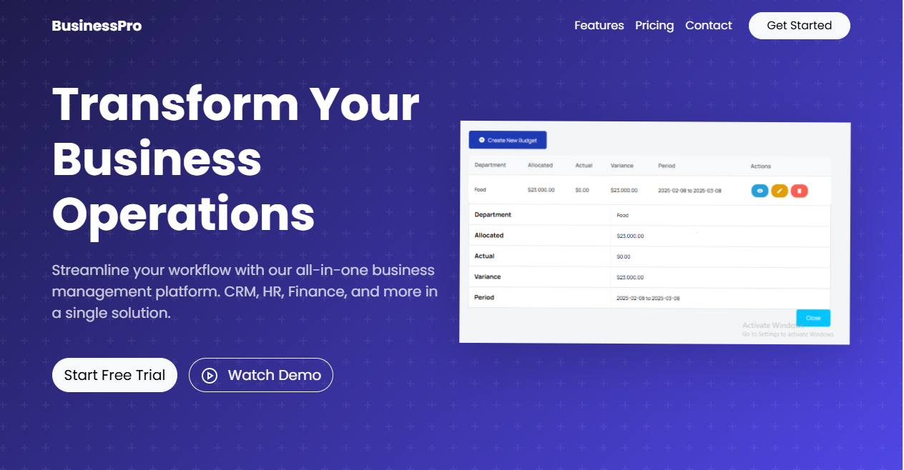
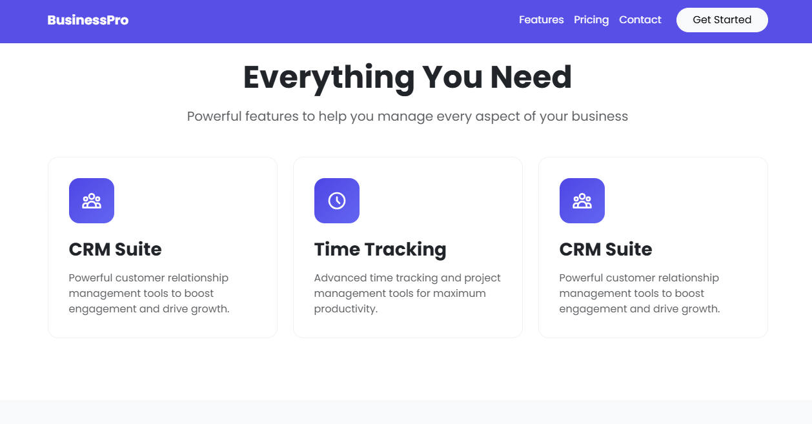
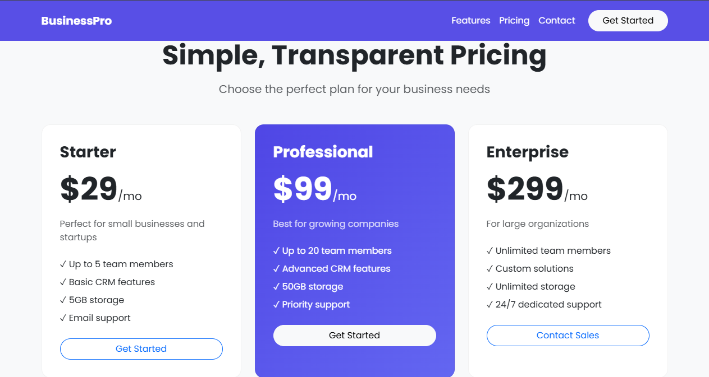
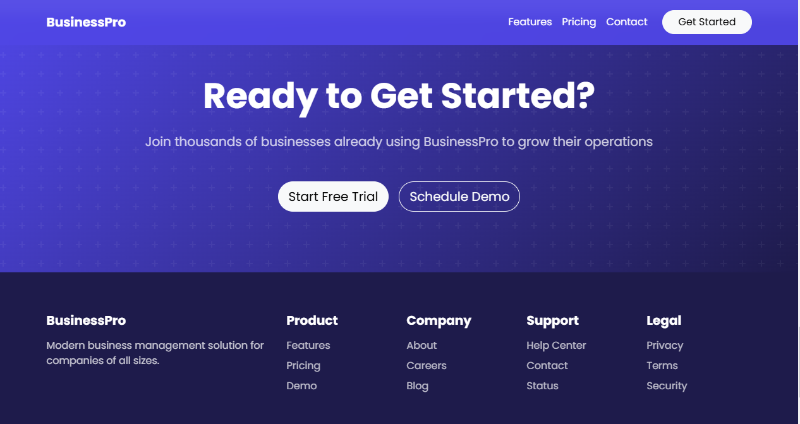

# BusinessPro - Modern Business Management Solution

[](https://github.com/kibali-cell)

**Live Demo:** [View BusinessPro Live](https://github.com/kibali-cell)

It was Primarily designed for A [Business Management System](https://github.com/kibali-cell/business)  am working on. 

---

## Overview

BusinessPro is a modern business management solution designed to streamline your workflow with an all-in-one platform. The website features a responsive design, engaging animations, and an intuitive user interface—built using HTML, CSS, JavaScript, Bootstrap 5, and AOS for scroll animations.

---

## Features

- **Responsive Design:** Built with Bootstrap 5 for a mobile-first, responsive layout.
- **Engaging Animations:** Smooth scroll animations using AOS.
- **User-Friendly Interface:** Clear navigation with a fixed-top navbar and visually appealing sections.
- **Modular Sections:** Includes a Hero section, Features, Pricing, Testimonials, Call-to-Action (CTA), and Footer.

---

## Preview

Here are some screenshots from BusinessPro:

### Features Section


### Pricing Section


### Footer Section


---

## Installation

To run the project locally, follow these steps:

1. **Clone the Repository:**
   ```bash
   git clone https://github.com/kibali-cell/Saas-Landing-Page.git
   
## Open the Website: 
Open index.html in your web browser to view the site locally.

## Technologies Used:

HTML5 & CSS3
JavaScript
Bootstrap 5
AOS (Animate On Scroll)
Google Fonts (Poppins)

## Contributing
Contributions are welcome! If you have suggestions, improvements, or bug fixes, please open an issue or submit a pull request.

## Contact
Developed by Jonas Kiwia.
For any inquiries or feedback, please feel free to reach out.
